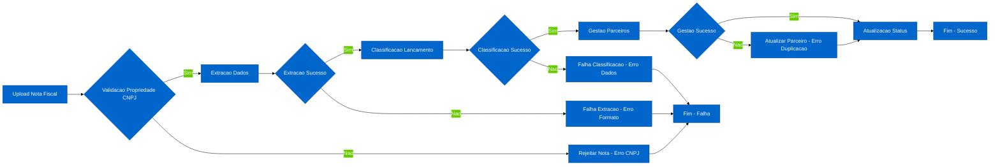
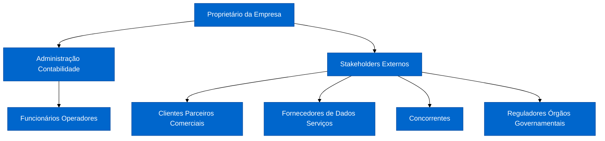

# Relatório de Desenvolvimento do Sistema de Gestão de Notas Fiscais

## INTRODUÇÃO

O presente documento descreve o desenvolvimento de um sistema de gestão de notas fiscais automatizada, com o objetivo de otimizar o processamento e controle financeiro de pequenas empresas. O projeto foi elaborado pelos alunos Vinicius Franco Silva, como parte da disciplina de Engenharia de Software I do curso de Tecnologia em Análise e Desenvolvimento de Sistemas da Faculdade de Tecnologia de Mogi das Cruzes.

A proposta visa solucionar um problema recorrente identificado no contexto de pequenas empresas: a dificuldade de processar manualmente notas fiscais, extrair dados relevantes e classificar lançamentos financeiros de forma eficiente. Atualmente, todo o processo é realizado de maneira manual, o que torna a operação propensa a erros, perda de tempo e prejuízos financeiros. Dessa forma, o sistema proposto contribuirá para a melhoria da gestão financeira, aumento da produtividade e padronização dos processos contábeis, mesmo para usuários com pouco domínio técnico.

O desenvolvimento do projeto seguiu os princípios da Engenharia de Software, que, como afirma Vasconcelos (2018), "envolve a aplicação sistemática de abordagens científicas e técnicas para o desenvolvimento, operação e manutenção de software de alta qualidade". Foram adotadas práticas como levantamento de requisitos funcionais e não funcionais, modelagem de casos de uso, definição de regras de negócio e implementação de padrões de projeto como Strategy e Observer, incluindo princípios SOLID aplicados em sistemas web, conforme Varella (2023) demonstra que "a aplicação dos princípios SOLID em sistemas web garante maior manutenibilidade", garantindo uma solução centrada nas reais necessidades do cliente.

Durante o processo, a equipe teve a oportunidade de aplicar metodologias ágeis de desenvolvimento e reforçar a importância do contato direto com o cliente para validação de requisitos. Além disso, foram desenvolvidas competências técnicas em modelagem de dados, desenvolvimento de APIs REST, processamento assíncrono com Celery, integração com banco de dados PostgreSQL e implementação de autenticação JWT, bem como habilidades interpessoais essenciais na Engenharia de Software, conforme Borges (2024) enfatiza que "o desenvolvimento de soft skills é essencial para estudantes de Engenharia de Software". O projeto também proporcionou uma reflexão crítica sobre a importância da usabilidade, segurança e performance em soluções destinadas a pequenos empreendedores, aspectos fundamentais para a aceitação do sistema pelos usuários, como aponta Gonçalves (2009) ao afirmar que "a usabilidade de software é fundamental para a aceitação pelos usuários".

## PROBLEMA

O cliente relata grandes dificuldades quanto ao processamento de notas fiscais, uma vez que não há um sistema automatizado que extraia dados estruturados dos arquivos de notas fiscais e classifique os lançamentos financeiros de forma precisa. Atualmente, como essa tarefa é feita manualmente, o processo torna-se trabalhoso, lento e suscetível a erros, especialmente em empresas com alto volume de transações.

Além disso, a falta de um sistema integrado para gestão de parceiros comerciais, controle de contas a pagar e receber, e geração de relatórios gerenciais dificulta o controle financeiro, a padronização dos processos contábeis e a tomada de decisões estratégicas. Diante disso, torna-se necessário o desenvolvimento de um sistema que realize automaticamente a extração de dados das notas fiscais, classifique os lançamentos financeiros, gerencie parceiros e forneça informações consolidadas para gestão, oferecendo ao cliente maior agilidade, precisão e controle no processo de gestão financeira.

## O NEGÓCIO

O sistema de gestão de notas fiscais é direcionado a pequenas empresas que necessitam de uma solução eficiente para processar e controlar suas transações comerciais. O negócio opera no segmento de gestão financeira, atendendo empresas que lidam com notas fiscais de entrada e saída, necessitando de automação para reduzir erros manuais e otimizar o tempo de processamento.

A produção do sistema é realizada através de desenvolvimento de software, utilizando tecnologias modernas como Django REST Framework, PostgreSQL, Celery e RabbitMQ. O público-alvo é composto por pequenas empresas e empreendedores individuais que buscam soluções acessíveis para gestão financeira, com destaque para aqueles que operam com vendas e compras frequentes.

A dificuldade a ser resolvida é a automação do processamento de notas fiscais, principalmente pela variabilidade de formatos de arquivos (PDF, XML, imagens), necessidade de classificação automática de lançamentos e integração com sistemas de notificações móveis.

O sistema visa automatizar e padronizar o processamento de notas fiscais, considerando variáveis como extração de dados, classificação de tipos de lançamento, gestão de parceiros e notificações em tempo real. Além disso, busca oferecer uma interface de API REST simples e acessível, compatível com aplicações móveis e web, visando usuários sem formação técnica avançada em gestão financeira.

A divulgação do sistema é feita através de documentação técnica e demonstrações práticas, com foco em ambientes acadêmicos e empresariais que valorizam soluções de código aberto e escaláveis, destacando a integração de Engenharia de Software com estatísticas para apoio educacional, como propõe Faria (2024) ao afirmar que "a Engenharia de Software e Estatística no Apoio à Educação a Distância facilitam o aprendizado".

## Processos de Negócio

Atualmente, os processos de gestão de notas fiscais em pequenas empresas são realizados de forma manual, sem uso de sistemas informatizados automatizados. O processamento envolve o upload de arquivos de notas fiscais, extração manual de dados estruturados (número da nota, CNPJs de remetente e destinatário, valores, datas), validação da propriedade da nota (empresa deve ser remetente ou destinatário), classificação automática de tipo de lançamento (PAGAR se destinatário, RECEBER se remetente), gestão de parceiros (cadastro e atualização automática baseada em CNPJ), e controle de status de processamento (PENDENTE → PROCESSANDO → CONCLUÍDO/FALHA). O controle de contas a pagar e receber é feito com registros não padronizados, o que pode gerar erros, perda de tempo e inconsistências. A falta de automação compromete a eficiência e a conformidade fiscal, especialmente em empresas com alto volume de transações.

### Diagrama dos Processos de Negócio (Mermaid - Diagrama de Atividades)

A seguir, apresentamos um diagrama de atividades em Mermaid com estilização profissional para ilustrar o fluxo horizontal dos processos de negócio, incluindo os eventos possíveis (sucesso ou falha) em cada etapa:



Este diagrama de atividades representa o fluxo horizontal dos processos, com decisões para eventos de erro (rejeição ou falha) e sucesso (avanço), garantindo clareza no tratamento de exceções e rastreabilidade.

## Stakeholders

No contexto de empresas MEI (Microempreendedor Individual), ME (Microempresa) e Simples Nacional, identificamos e entendemos as expectativas dos usuários para garantir o sucesso do projeto de gestão de notas fiscais automatizada, considerando stakeholders internos e externos específicos para esses tipos de negócio. A seguir, apresentamos um organograma em formato Mermaid (diagrama de fluxo) para representar a estrutura hierárquica dos stakeholders:



Este organograma ilustra a estrutura de stakeholders em empresas de pequeno porte (MEI, ME, Simples Nacional), com o proprietário no topo, seguido pelos internos (administração e funcionários) e externos (clientes, fornecedores, concorrentes e reguladores). Cada grupo tem interesses e impactos específicos no projeto, conforme descrito abaixo.

**Stakeholders Internos:**

Proprietário da Empresa:
Interesse: Lucratividade geral, competitividade no mercado, percepção de valor da marca, sustentabilidade do negócio, conformidade fiscal com regimes como Simples Nacional.
Impacto: Decisores finais, aprovadores de estratégias de gestão, definem metas financeiras e de conformidade, especialmente em contextos de MEI/ME com limitações de faturamento.

Administração/Contabilidade:
Interesse: Precisão nos lançamentos financeiros, eficiência operacional, redução de erros manuais, feedback da equipe, conformidade com regras de negócio e obrigações fiscais simplificadas.
Impacto: Fornecem dados financeiros, insights sobre custos, validam regras de classificação automática, responsáveis pela implementação e validação dos processos em empresas de pequeno porte.

Funcionários/Operadores:
Interesse: Facilidade de uso do sistema, tempo de processamento reduzido, qualidade dos dados extraídos, suporte a diferentes formatos de arquivo, adequação a operações enxutas de MEI/ME.
Impacto: Utilizam o sistema diariamente para upload e consulta, fornecem feedback sobre usabilidade, impacto de mudanças nos processos em ambientes com poucos recursos.

**Stakeholders Externos:**

Clientes (Parceiros Comerciais):
Interesse: Precisão nos lançamentos, rapidez no processamento, valor percebido dos serviços, conformidade fiscal, adequação a transações B2B em Simples Nacional.
Impacto: Beneficiários diretos dos lançamentos (contas a pagar/receber), fornecem feedback sobre a eficiência do sistema em cadeias de suprimento locais.

Fornecedores de Dados/Serviços:
Interesse: Integração com sistemas existentes, volume de uso, relacionamento comercial, compatibilidade com fornecedores de pequeno porte.
Impacto: Fornecedores de arquivos de notas fiscais ou APIs, custos afetam a viabilidade do sistema em orçamentos limitados de MEI/ME.

Concorrentes:
Interesse: Estratégias de mercado, participação, posicionamento em gestão fiscal, competição em nichos de pequenos negócios.
Impacto: Influenciam a definição de funcionalidades competitivas, como automação acessível para Simples Nacional.

Reguladores / Órgãos Governamentais (SEFAZ, Receita Federal):
Interesse: Conformidade com leis fiscais, emissão e processamento correto de notas fiscais, segurança de dados, adesão a regimes como Simples Nacional.
Impacto: Garantir que o sistema esteja em conformidade com normas fiscais brasileiras, evitando penalidades em empresas de pequeno porte.

Identificar e gerenciar as expectativas de cada um desses stakeholders é fundamental para que o projeto de gestão seja bem-sucedido em empresas MEI, ME e Simples Nacional, mantendo todos informados sobre o progresso, validando regras de negócio e assegurando conformidade fiscal.

## Concorrentes

Podemos dividir os concorrentes do sistema de gestão de notas fiscais em concorrentes diretos e indiretos. Os concorrentes diretos oferecem soluções similares de processamento automatizado de notas fiscais, com foco em pequenas e médias empresas. Alguns exemplos incluem:

- **NFE.io**: Plataforma especializada em emissão e gestão de notas fiscais, com APIs para integração e automação.
- **Focus NFe**: Sistema para emissão e consulta de notas fiscais, com suporte a diferentes formatos e validação automática.
- **Omie**: ERP que inclui módulos de gestão fiscal, com processamento de notas e integração contábil.
- **Conta Azul**: Software de gestão empresarial com funcionalidades de emissão e controle de notas fiscais.
- **Bling**: Plataforma de ERP e e-commerce com automação de notas fiscais e integração com marketplaces.
- **Tiny ERP**: Sistema de gestão com emissão de notas e controle financeiro integrado.

Já os concorrentes indiretos são alternativas que disputam o mesmo público de gestão financeira, mesmo sem foco específico em notas fiscais:

- **Planilhas e sistemas manuais (Excel, Google Sheets)**: Oferecem praticidade inicial e custos baixos, mas sem automação ou validação fiscal.
- **Softwares de contabilidade geral (como QuickBooks ou similares brasileiros)**: Incluem processamento de notas, mas com menos especialização em automação.
- **Serviços de terceirização contábil**: Empresas que oferecem processamento manual ou semi-automatizado de notas fiscais.
- **Soluções open-source ou gratuitas**: Como sistemas baseados em Odoo ou customizados, que competem pelo custo.

Esses concorrentes influenciam a definição de preços, funcionalidades e posicionamento do sistema, exigindo diferenciais como automação via IA, integração com APIs fiscais e usabilidade superior.

## SOLUÇÃO PROPOSTA

A solução proposta consiste no desenvolvimento de um sistema digital voltado para a gestão automatizada de notas fiscais, baseado nos requisitos funcionais identificados. O software será uma aplicação web responsiva, acessível por dispositivos móveis e desktops, com interface amigável voltada a usuários leigos. O sistema permitirá o upload assíncrono de arquivos de notas fiscais, extração automática de dados estruturados (número, CNPJs, valores, datas), classificação automática de lançamentos financeiros (contas a pagar/receber), gestão automática de parceiros, consulta de status de processamento via UUID, listagem de contas pendentes ordenadas por vencimento, dashboard gerencial com métricas consolidadas, e auditoria de operações. Entre os principais módulos estão:

- Processamento de Notas Fiscais (upload e extração)
- Classificação Automática de Lançamentos
- Gestão de Parceiros
- Consultas Financeiras (contas a pagar/receber)
- Dashboard Gerencial
- Auditoria e Versionamento de API

Essa solução visa eliminar os processos manuais e empíricos atualmente utilizados, promovendo maior precisão, controle financeiro, conformidade fiscal e tomada de decisão fundamentada, atendendo às regras de negócio como validação de propriedade, unicidade de CNPJ e processamento assíncrono.

## Hardware e Software

A solução será desenvolvida como uma aplicação web multiplataforma, garantindo fácil acesso tanto em computadores quanto em dispositivos móveis. As características técnicas incluem:

Linguagens de Programação:
- Frontend: HTML5, CSS3, JavaScript (framework React Native para mobile, web para desktop)
- Backend: Python com Django REST Framework
Banco de Dados:
- PostgreSQL como Sistema Gerenciador de Banco de Dados Relacional
Sistemas Operacionais Compatíveis:
- Windows, Linux, Android, iOS (via navegador ou app mobile)
Serviço de Hospedagem:
- Plataforma em nuvem (ex.: AWS, Heroku) com suporte a Python, PostgreSQL e Celery
Requisitos Técnicos Mínimos para Equipamentos:
- Desktop ou Notebook: Navegador atualizado (Google Chrome, Firefox, etc.), conexão com internet
- Smartphone: Android 7.0 ou superior / iOS 11 ou superior com navegador web ou app
Outras Tecnologias Complementares:
- Git/GitHub para controle de versão
- Docker para empacotamento e deploy da aplicação
- Celery + RabbitMQ para processamento assíncrono
- JWT para autenticação
- Figma para prototipação da interface
A escolha dessas tecnologias busca garantir baixo custo de manutenção, escalabilidade, segurança e facilidade de uso, além de atender aos requisitos funcionais e não funcionais, como processamento assíncrono e conformidade com regras de negócio.

## Cronograma Macro

Insira aqui um cronograma macro do desenvolvimento do projeto.

| Atividade | Início Previsto | Término Previsto |
|-----------|-----------------|------------------|
| 1. Entendimento do problema e do negócio. | 06/06/2025 | 10/06/2025 |
| 2. Definição inicial dos requisitos funcionais, requisitos não funcionais e regras de negócio. | 06/06/2025 | 12/06/2025 |
| 3. Elaboração do Modelo de Casos de Uso preliminar. | 10/06/2025 | 15/06/2025 |
| 4. Documentação dos Casos de Uso. | 10/06/2025 | 15/06/2025 |
| 5. Validação (aprovação) dos requisitos pelo cliente. | 15/06/2025 | 17/06/2025 |

Quadro 1. Exemplo de Cronograma Macro

## Engenharia de Requisitos

### Requisitos Funcionais

| Código | Nome Abreviado | Descrição | Obrigatório ou Desejável |
|--------|----------------|-----------|--------------------------|
| RF001 | Processamento de Notas Fiscais | O sistema deve permitir o upload e processamento assíncrono de arquivos de notas fiscais. | Obrigatório |
| RF002 | Extração de Dados | O sistema deve extrair automaticamente dados estruturados das notas fiscais. | Obrigatório |
| RF003 | Classificação Automática | O sistema deve classificar automaticamente os lançamentos financeiros baseado no CNPJ da empresa. | Obrigatório |
| RF004 | Gestão de Parceiros | O sistema deve gerenciar automaticamente o cadastro de parceiros comerciais. | Obrigatório |
| RF005 | Consulta Status | O sistema deve permitir consultar o status de processamento de um job. | Obrigatório |
| RF006 | Contas a Pagar | O sistema deve listar todas as contas a pagar pendentes. | Obrigatório |
| RF007 | Contas a Receber | O sistema deve listar todas as contas a receber pendentes. | Obrigatório |
| RF008 | Dashboard | O sistema deve fornecer informações consolidadas para gestão. | Desejável |
| RF009 | Auditoria | O sistema deve registrar informações de auditoria nas operações. | Desejável |
| RF010 | Versionamento API | O sistema deve suportar versionamento de API com fallback. | Desejável |

### Requisitos não funcionais

| Categoria Principal | Subcategoria | RNF | Descrição |
|---------------------|--------------|-----|-----------|
| Confiabilidade (reliability) | Disponibilidade | RNF01 | O sistema deve estar disponível continuamente (24 horas por dia e 7 dias por semana). |
| Confiabilidade (reliability) | Tolerância a falhas | RNF02 | Os cálculos de classificação e extração devem seguir algoritmos definidos com precisão, sem perdas de dados. |
| Confiabilidade (reliability) | Tolerância a falhas | RNF03 | O sistema deve detectar e tratar erros comuns (ex.: arquivos inválidos, CNPJs incorretos) sem travar. |
| Confiabilidade (reliability) | Consistência dos dados | RNF04 | As informações salvas devem permanecer íntegras mesmo após interrupções. |
| Usabilidade (usability) | Operabilidade | RNF05 | O sistema deve possuir uma interface simples e acessível, com linguagem clara. |
| Eficiência de desempenho (performance efficiency) | Capacidade | RNF06 | O tempo de resposta para consultas deve ser inferior a 2 segundos. |
| Segurança (security) | Confidencialidade | RNF07 | Dados fiscais só são acessíveis pelo proprietário da empresa. |
| Portabilidade (portability) | Adaptabilidade | RNF08 | O sistema deve ser acessível via web e mobile. |

Quadro 3. Especificação de Requisitos não Funcionais.

## Regras de Negócio

| RN | Descrição |
|----|-----------|
| RN01 | Uma nota fiscal só pode ser processada se a empresa informada participar como remetente ou destinatário. |
| RN02 | O tipo de lançamento financeiro é determinado automaticamente pela posição da empresa na nota fiscal. |
| RN03 | O tipo de parceiro é determinado automaticamente pelo tipo de lançamento gerado. |
| RN04 | Cada CNPJ pode ter apenas um registro de parceiro no sistema. |
| RN05 | Cada CNPJ pode ter apenas um registro de empresa no sistema. |
| RN06 | O processamento de jobs deve seguir uma sequência específica de status. |
| RN07 | Lançamentos financeiros iniciam sempre como PENDENTE. |
| RN08 | Todo lançamento financeiro deve estar vinculado a uma nota fiscal. |
| RN09 | O valor do lançamento financeiro deve corresponder ao valor total da nota fiscal. |
| RN10 | Registros com relacionamentos não podem ser excluídos diretamente. |
| RN11 | Dados de parceiros devem ser atualizados automaticamente quando houver divergência. |
| RN12 | IDs internos não devem ser expostos publicamente. |
| RN13 | Processamento de notas fiscais deve ser sempre assíncrono. |
| RN14 | Consultas financeiras devem filtrar apenas registros relevantes. |
| RN15 | Processamento de nota fiscal deve ser atômico. |

Quadro 4. Regras de Negócio.

## Matriz de Rastreabilidade

| RN | RF001 | RF002 | RF003 | RF004 | RF005 | RF006 | RF007 | RF008 | RF009 | RF010 |
|----|-------|-------|-------|-------|-------|-------|-------|-------|-------|-------|
| RN01 | X | X | X |  |  |  |  |  |  |  |
| RN02 |  |  | X |  |  |  |  |  |  |  |
| RN03 |  |  | X | X |  |  |  |  |  |  |
| RN04 |  |  |  | X |  |  |  |  |  |  |
| RN05 | X |  |  |  |  |  |  |  |  |  |
| RN06 | X |  |  |  | X |  |  |  |  |  |
| RN07 |  |  | X |  |  |  |  |  |  |  |
| RN08 |  |  | X |  |  |  |  |  |  |  |
| RN09 |  |  | X |  |  |  |  |  |  |  |
| RN10 |  |  |  | X |  |  |  |  |  |  |
| RN11 |  |  |  | X |  |  |  |  |  |  |
| RN12 |  |  |  |  | X | X | X | X |  | X |
| RN13 | X |  |  |  |  |  |  |  |  |  |
| RN14 |  |  |  |  |  | X | X |  |  |  |
| RN15 | X | X | X | X |  |  |  |  |  |  |

Quadro 5. Matriz de Rastreabilidade.

## Modelo de Casos de Uso Preliminar

### Diagrama de Casos de Uso (Mermaid)

```mermaid
usecase
    actor "Proprietário da Empresa" as Proprietario
    actor "Funcionários" as Funcionarios
    
    usecase "Upload de Nota Fiscal" as UC1
    usecase "Consultar Status de Processamento" as UC2
    usecase "Listar Contas a Pagar" as UC3
    usecase "Listar Contas a Receber" as UC4
    usecase "Visualizar Dashboard" as UC5
    
    Proprietario --> UC1
    Proprietario --> UC2
    Proprietario --> UC3
    Proprietario --> UC4
    Proprietario --> UC5
    Funcionarios --> UC2
```

### Descrição dos Atores

**Proprietário da Empresa:**
Descrição: Usuário principal responsável pela gestão financeira da empresa.
Responsabilidades: Upload de notas fiscais, consulta de status, visualização de contas a pagar/receber, acesso ao dashboard.
Nível de conhecimento técnico: Leigo em tecnologia, focado em gestão financeira.

**Funcionários:**
Descrição: Auxiliares na operação diária, com acesso limitado.
Responsabilidades: Consulta de informações, suporte ao proprietário.
Nível de conhecimento técnico: Básico em informática.

### Documentação dos Casos de Uso

| Caso de Uso | Ator(es) | Descrição | Pré-condições | Pós-condições | Fluxo Principal |
|-------------|----------|-----------|---------------|---------------|-----------------|
| Upload de Nota Fiscal | Proprietário da Empresa | Permite o upload de arquivos de notas fiscais para processamento. | Usuário autenticado. | Job de processamento criado. | 1. Usuário acessa interface de upload. 2. Seleciona arquivo. 3. Sistema valida formato. 4. Cria job e retorna UUID. |
| Consultar Status de Processamento | Proprietário da Empresa, Funcionários | Permite verificar o status de um job de processamento. | UUID do job disponível. | Status exibido. | 1. Usuário informa UUID. 2. Sistema busca job. 3. Exibe status e detalhes. |
| Listar Contas a Pagar | Proprietário da Empresa | Lista lançamentos a pagar pendentes. | Lançamentos processados. | Lista exibida. | 1. Usuário solicita listagem. 2. Sistema filtra e ordena. 3. Exibe resultados. |
| Listar Contas a Receber | Proprietário da Empresa | Lista lançamentos a receber pendentes. | Lançamentos processados. | Lista exibida. | 1. Usuário solicita listagem. 2. Sistema filtra e ordena. 3. Exibe resultados. |
| Visualizar Dashboard | Proprietário da Empresa | Exibe métricas consolidadas para gestão. | Dados processados disponíveis. | Dashboard exibido. | 1. Usuário acessa dashboard. 2. Sistema calcula métricas. 3. Exibe gráficos e totais. |

## REFERÊNCIAS

BORGES, G. G. Framework para auxílio no desenvolvimento de soft skills em estudantes de Engenharia de Software. 2024. Dissertação (Mestrado em Ciência da Computação) - Universidade Estadual Paulista, São Paulo, 2024.

FARIA, E. Engenharia de Software e Estatística no Apoio à Educação a Distância. Anais CIET: Horizonte, 2024.

GONÇALVES, M. K. Usabilidade de software: estudo de recomendações básicas para verificação do nível de conhecimento dos alunos dos cursos de Design Gráfico e Sistemas de Informação da Unesp. 2009. Dissertação (Mestrado em Design) - Universidade Estadual Paulista, Bauru, 2009.

VARELLA, J. C. B. Aplicação de solid em um sistema web para intermediação de compra e venda de comida na Unesp. 2023. Trabalho de Conclusão de Curso (Bacharelado em Ciência da Computação) - Universidade Estadual Paulista, Bauru, 2023.

VASCONCELOS, A. K. M. Caracterização de gestão de produtos de software nas universidades federais brasileiras. 2018. Dissertação (Mestrado em Sistemas de Informação) - Universidade de São Paulo, São Paulo, 2018.