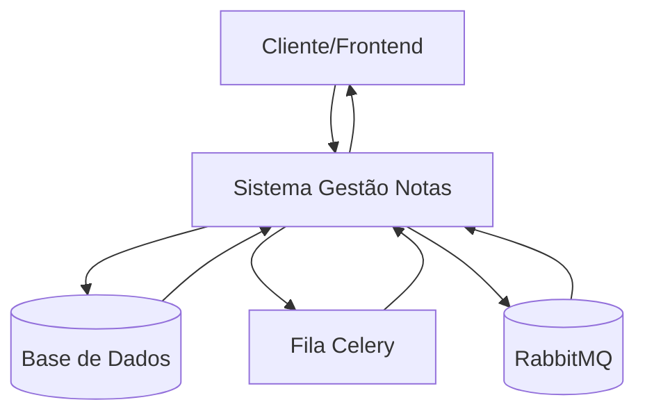
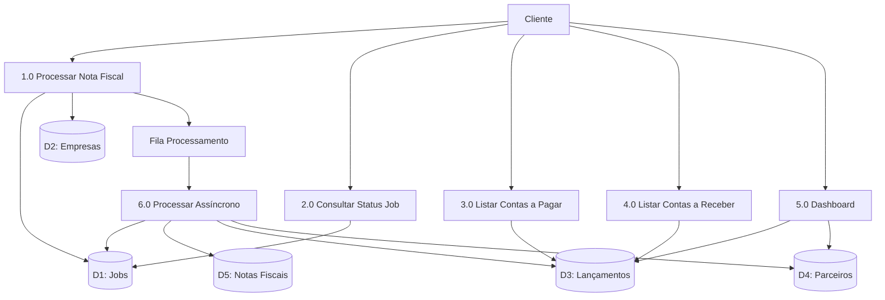
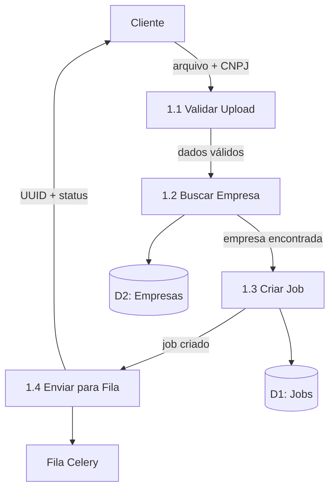
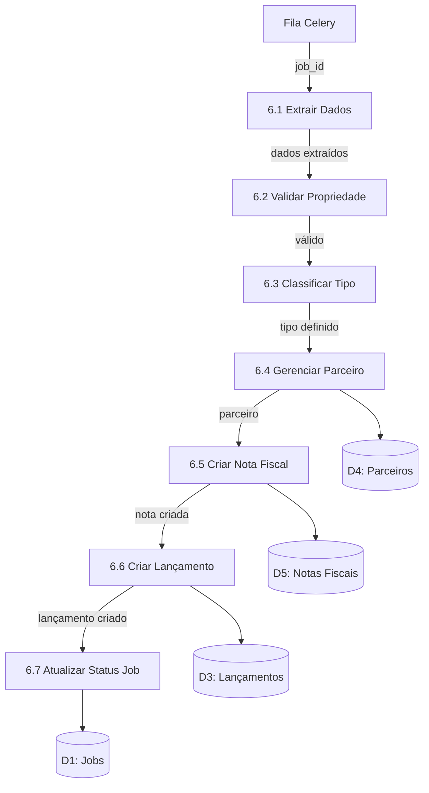
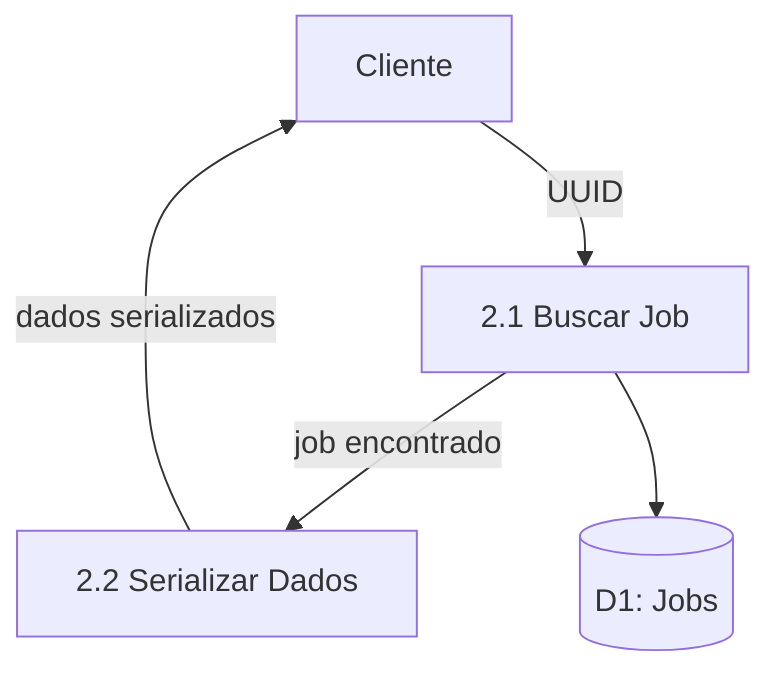
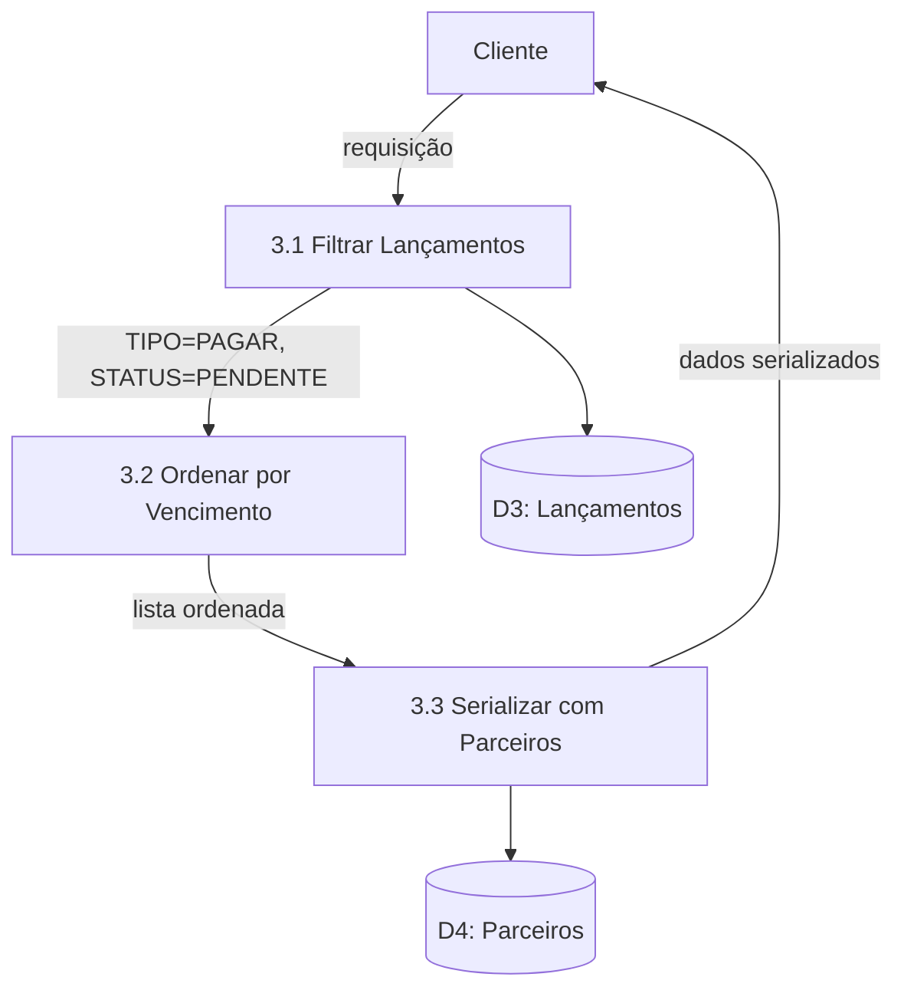
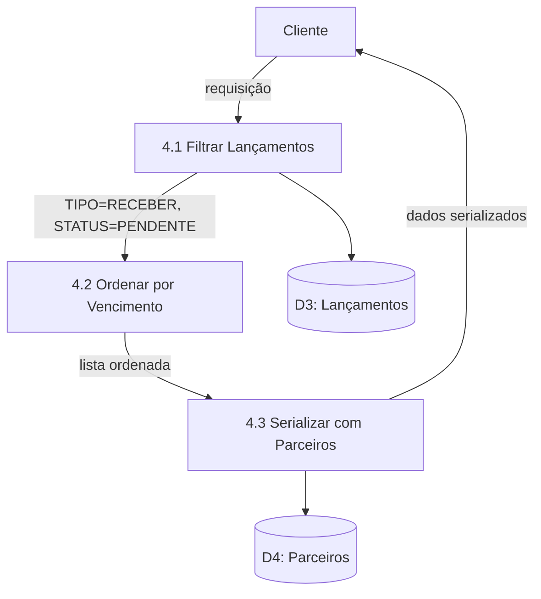
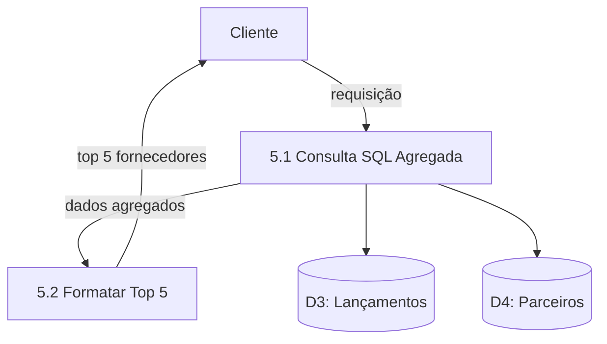

# Diagramas de Fluxo de Dados - Sistema de Gestão de Notas Fiscais

## DFD Nível 0 - Contexto Geral



## DFD Nível 1 - Processos Principais



## DFD Nível 2 - Detalhamento por Funcionalidade

### 1.0 Processar Nota Fiscal



### 6.0 Processar Assíncrono



### 2.0 Consultar Status Job



### 3.0 Listar Contas a Pagar



### 4.0 Listar Contas a Receber



### 5.0 Dashboard



## Fluxo de Dados Detalhado

### Estruturas de Dados

**Upload Request:**
```
{
  arquivo: File,
  meu_cnpj: String
}
```

**Job Response:**
```
{
  uuid: UUID,
  status: {codigo: String, descricao: String}
}
```

**Job Status Response:**
```
{
  uuid: UUID,
  status: String,
  dt_criacao: DateTime,
  dt_conclusao: DateTime,
  mensagem_erro: String
}
```

**Lançamento Response:**
```
{
  uuid: UUID,
  descricao: String,
  valor: Decimal,
  data_vencimento: Date,
  data_pagamento: Date,
  clf_tipo: {codigo: String, descricao: String},
  clf_status: {codigo: String, descricao: String},
  dt_criacao: DateTime,
  dt_alteracao: DateTime
}
```

**Dashboard Response:**
```
{
  top_5_fornecedores_pendentes: [
    {
      nome: String,
      cnpj: String,
      total_a_pagar: Decimal
    }
  ]
}
```

## Armazenamento de Dados

### Entidades Principais
- **Jobs:** Controle de processamento
- **Empresas:** Cadastro da empresa usuária
- **Parceiros:** Fornecedores e clientes
- **Notas Fiscais:** Documentos processados
- **Lançamentos:** Movimentações financeiras
- **Classificadores:** Tipos e status padronizados

### Relacionamentos
- Job 1:N Notas Fiscais
- Nota Fiscal 1:1 Lançamento Financeiro
- Parceiro 1:N Notas Fiscais
- Empresa 1:N Jobs
- Classificador 1:N (Jobs, Lançamentos, Parceiros)