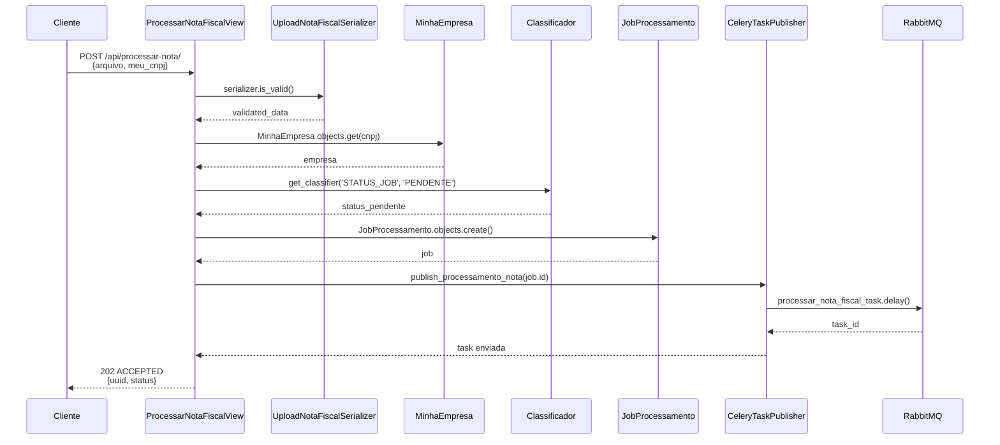
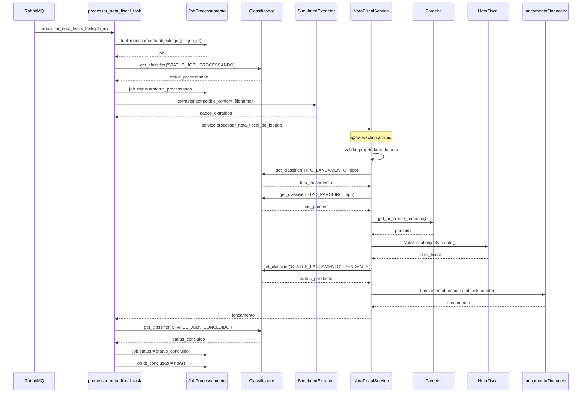
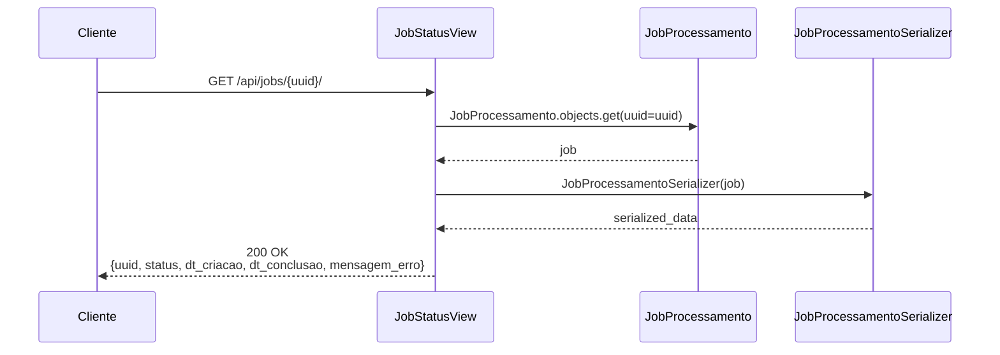
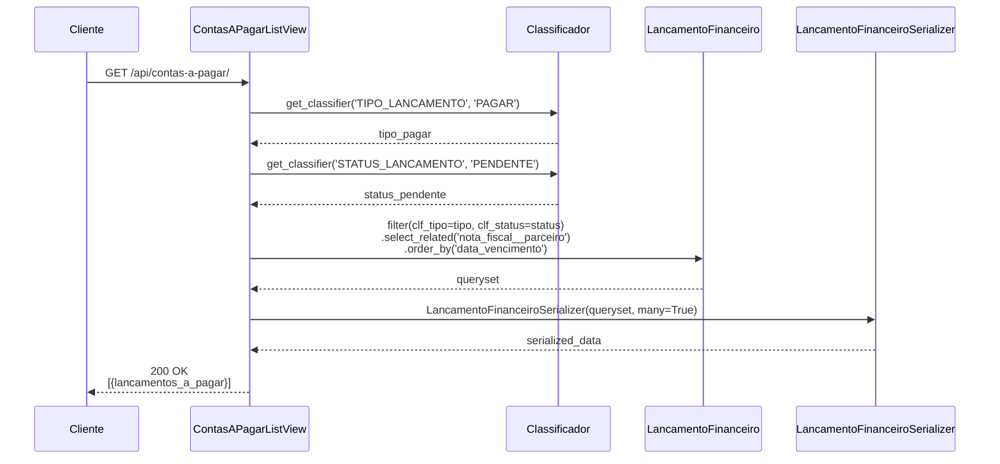
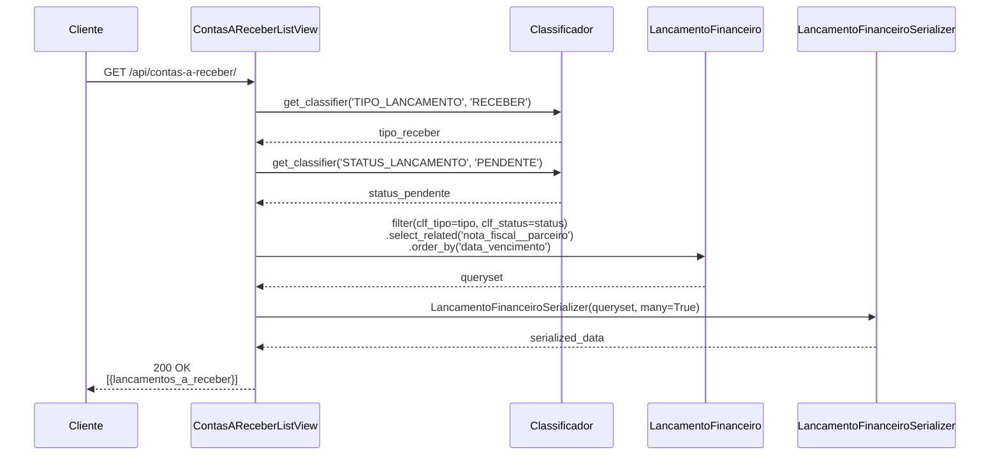
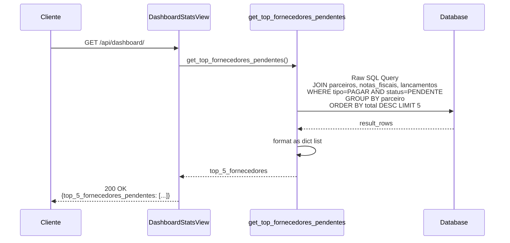
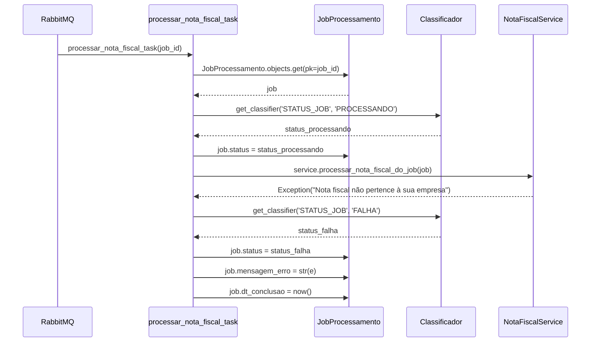
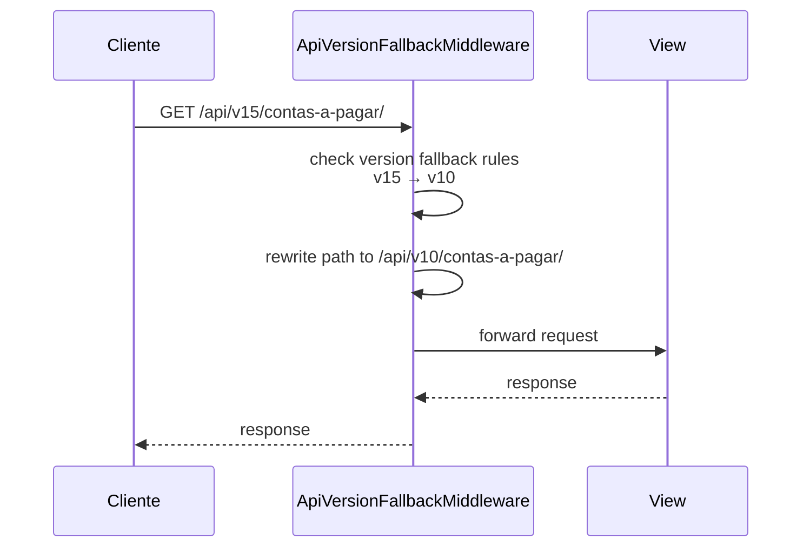

# Diagramas de Sequência - Sistema de Gestão de Notas Fiscais

## 1. POST /api/processar-nota/ - Processamento de Nota Fiscal

## 2. Processamento Assíncrono (Celery Task)

## 3. GET /api/jobs/<uuid>/ - Consulta Status do Job

## 4. GET /api/contas-a-pagar/ - Listar Contas a Pagar

## 5. GET /api/contas-a-receber/ - Listar Contas a Receber

## 6. GET /api/dashboard/ - Dashboard Gerencial

## 7. Fluxo de Erro - Processamento com Falha

## 8. Middleware de Versionamento (Opcional)

## Padrões de Interação Identificados

### 1. **Padrão Request-Response Síncrono**
- Usado em: consultas (jobs, contas, dashboard)
- Características: resposta imediata, operações de leitura

### 2. **Padrão Request-Acknowledge-Process Assíncrono**
- Usado em: processamento de notas fiscais
- Características: resposta imediata com UUID, processamento em background

### 3. **Padrão Repository com ORM**
- Usado em: todas as operações de dados
- Características: abstração de banco via Django ORM

### 4. **Padrão Publisher-Subscriber**
- Usado em: envio de tarefas para Celery
- Características: desacoplamento via fila de mensagens

### 5. **Padrão Transaction Script**
- Usado em: processamento completo da nota fiscal
- Características: operação atômica com rollback automático

### 6. **Padrão Strategy**
- Usado em: extração de dados (ExtractorInterface)
- Características: algoritmo plugável para diferentes tipos de arquivo