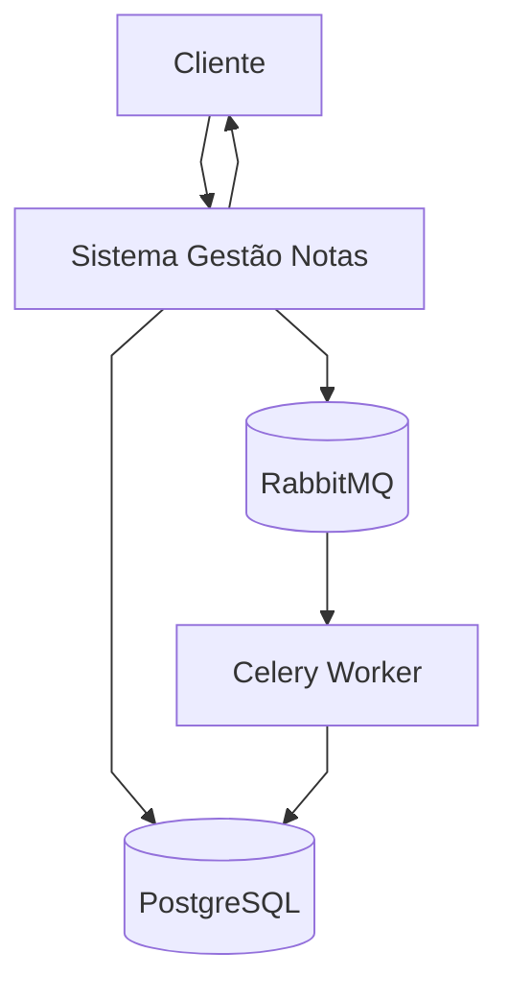
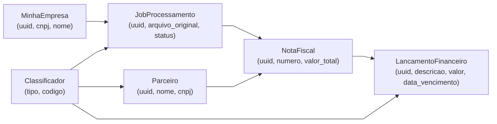

# Relatório Resumido — Gestão de Notas

Visão executiva do projeto com principais módulos, endpoints e fluxos.

> Resumo executivo

Um panorama conciso do sistema de gestão de notas: arquitetura, módulos principais, endpoints críticos e o fluxo central de processamento de notas fiscais.

---

## Sumário

- [Arquitetura](#arquitetura)
- [Principais Módulos](#principais-módulos)
- [Modelos-chave](#modelos-chave)
- [Fluxo Central (Assíncrono)](#fluxo-central-assíncrono)
- [Endpoints em Destaque](#endpoints-em-destaque)
- [Infra e Operação](#infra-e-operação)
- [Diagrams & Docs](#diagrams--docs)

---

## Arquitetura
- Django + DRF (ASGI), PostgreSQL, Celery + RabbitMQ
- JWT com autenticação por empresa (claims `emp_uuid`, `emp_cnpj`)
- Padrões: Strategy (extração e tipo de lançamento), Observer (notificações/validações), Publisher-Subscriber (Celery)

### Diagrama — Contexto (DFD Nível 0, linhas retas)
<div align="center">



</div>

## Principais Módulos
- Empresa: login e setup de senha (`/api/auth/login/`, `/api/auth/setup-senha/`)
- Processamento: upload assíncrono e status (`/api/processar-nota/`, `/api/jobs/<uuid>/`)
- Financeiro: listagens (`/api/contas-a-pagar/`, `/api/contas-a-receber/`)
- Dashboard: métricas (`/api/dashboard/`)
- Notifications: dispositivos, pendências, confirmação (`/api/notifications/*`)

## Modelos-chave
- `MinhaEmpresa` 1:N `JobProcessamento`
- `JobProcessamento` 1:N `NotaFiscal`
- `NotaFiscal` 1:1 `LancamentoFinanceiro`
- `Parceiro` (CLIENTE/FORNECEDOR via `Classificador`)

### Diagrama — Modelagem de Dados (alto nível)
<div align="center">



</div>

## Fluxo Central (Assíncrono)
1. POST `/api/processar-nota/` recebe `arquivo` + `meu_cnpj`
2. Cria `Job` (PENDENTE), envia Celery
3. Task processa: extrai dados (Strategy), decide tipo/cliente-fornecedor (Strategy), cria Nota + Lançamento (transaction), notifica Observers
4. Cliente consulta GET `/api/jobs/<uuid>/`

### Try it — upload e consulta de job

Em um terminal (cURL) você pode testar o upload e, depois, consultar o job:

```bash
# Upload (multipart)
curl -X POST -F "arquivo=@/caminho/para/notafiscal.xml" -F "meu_cnpj=99.999.999/0001-99" http://localhost:8000/api/processar-nota/

# Consulta de status do job
curl http://localhost:8000/api/jobs/<uuid-do-job>/
```

## Endpoints Em Destaque
- Autenticação: POST `/api/auth/login/` → `{access, refresh, empresa}`
- Processar Nota: POST `/api/processar-nota/` → `202 {uuid, status}`
- Status Job: GET `/api/jobs/<uuid>/`
- Contas: GET `/api/contas-a-pagar/`, `/api/contas-a-receber/`
- Dashboard: GET `/api/dashboard/`
- Notificações: POST `register-device/`, GET `pending/`, POST `ack/`

## Infra e Operação
- Docker Compose com: `db`, `rabbitmq`, `web` (Gunicorn+Uvicorn), `worker` (Celery), `nginx`, `loki`, `grafana`, `promtail`
- Healthcheck: GET `/healthz`

## Diagrams & Docs
- DFDs/Sequência: `docs/diagramas-fluxo-dados.md`, `docs/diagramas-sequencia.md`
- Endpoints e domínios: `docs/diagrams/*.puml`
- Regras e requisitos: `docs/regras-negocio.md`, `docs/requisitos-funcionais.md`

Imagem de padrões (exemplo):


---

## Requisitos & Rastreabilidade (resumido)

Principais requisitos e onde foram implementados (resumo):

- RF001 (Processamento assíncrono): `apps.processamento` + Celery (`processar_nota_fiscal_task`) — endpoint POST `/api/processar-nota/`.
- RF002 (Extração): `apps.notas.extractors` usado por `NotaFiscalService`.
- RF003 (Classificação automática): `apps.financeiro.strategies` (NotaCompra/NotaVenda) usado pelo serviço.
- RF005 (Consulta de status): GET `/api/jobs/<uuid>/` em `apps.processamento.views`.
- RN001 (Validação de propriedade): ver `TipoLancamentoContext` / `NotaFiscalService`.

Para a matriz completa com mapeamento por arquivo e endpoint veja `docs/relatorio-completo.md`.

